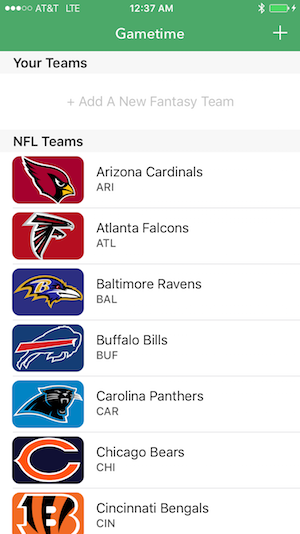
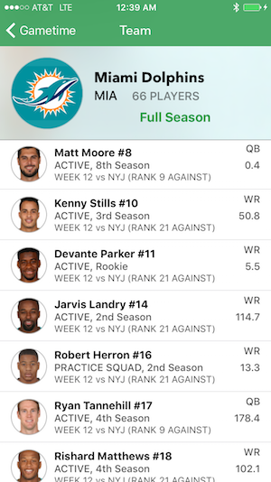

## Gametime

NFL Fantasy Football Game Center App made on Thanksgiving 2015. [Watch a short demo video of the Thanksgiving day build](https://streamable.com/tuqd)[!](gametime.mov) 

 

---
 
### What is Gametime?

Gametime is a really simple, really good app for keeping track of NFL games. I had the idea to finally make a football app worth using after spending Thanksgiving playing with my family. My initial build was made in about 5-6 hours entirely during Thursday (and 90% during the football games themselves, considering the commercials were 90% of each game…).

### Why make Gametime?

Gametime was built for myself. Its primary purpose is not commercial nor competitive; I simply found myself getting headaches using every other app in the market. Once I discovered the NFL Fantasy API is rather open it became an issue of _when_ rather than _why_ (although I am still awaiting a response email letting me in directly).

### What are your plans for Gametime?

The current backend, besides the static team data, is completely supplied by [fantasydata](https://fantasydata.com) JSON. The suite of fantasy features that Gametime requires to be functional is still not present - in the Thanksgiving build it is only possible to get season or week-based stats for NFL games. There is no long-term storage besides static dictionary disk IO, so long requests might stack up fast when browsing through teams and material, without any real reuse. In addition, CBS/FOX/ESPN/NFL/Yahoo/etc each have their own apps (and it's because of them I have the API I do, I bet), none of which I desire to wage war with in any way.

So, the future of Gametime is purely personal, for now. I'm going to keep working on it in my off time, particularly during football games, but besides that, everything's staying low-key.

Enjoy!

---

## License
	
	Copyright (c) 2015 Julian Weiss
	
	Permission is hereby granted, free of charge, to any person obtaining a copy of this software and associated documentation files (the "Software"), to deal in the Software without restriction, including without limitation the rights to use, copy, modify, merge, publish, distribute, sublicense, and/or sell copies of the Software, and to permit persons to whom the Software is furnished to do so, subject to the following conditions:
	
	The above copyright notice and this permission notice shall be included in all copies or substantial portions of the Software.
	
	THE SOFTWARE IS PROVIDED "AS IS", WITHOUT WARRANTY OF ANY KIND, EXPRESS OR IMPLIED, INCLUDING BUT NOT LIMITED TO THE WARRANTIES OF MERCHANTABILITY, FITNESS FOR A PARTICULAR PURPOSE AND NONINFRINGEMENT. IN NO EVENT SHALL THE AUTHORS OR COPYRIGHT HOLDERS BE LIABLE FOR ANY CLAIM, DAMAGES OR OTHER LIABILITY, WHETHER IN AN ACTION OF CONTRACT, TORT OR OTHERWISE, ARISING FROM, OUT OF OR IN CONNECTION WITH THE SOFTWARE OR THE USE OR OTHER DEALINGS IN THE SOFTWARE.
